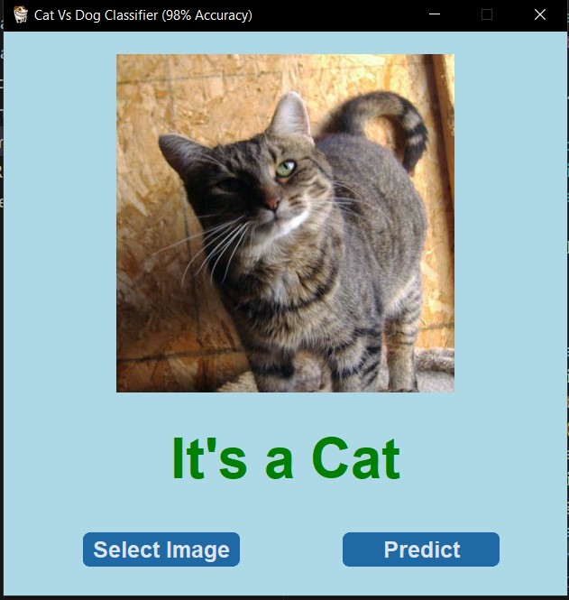
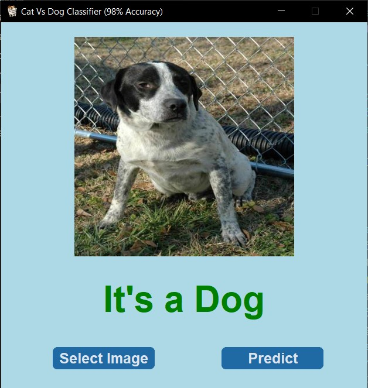

# 🐱🐶 Cat vs Dog Classifier (98% Accuracy)

This is a **Deep Learning GUI Application** built using **PyTorch** and **CustomTkinter** that classifies whether an uploaded image is of a **Cat** or a **Dog**.  
The model is trained using **Transfer Learning (ResNet18)** and achieves **98% accuracy**.

---

## 🚀 Features
- ✅ GUI built with [CustomTkinter](https://github.com/TomSchimansky/CustomTkinter)  
- ✅ Classifies **Cats vs Dogs** with **98% accuracy**  
- ✅ Uses **Transfer Learning (ResNet18)** for robust performance  
- ✅ Supports **JPG, JPEG, PNG** image formats  
- ✅ Shows prediction results in real time  

---

## 🖥️ Tech Stack
- **Python**
- **PyTorch**
- **Torchvision (ResNet18)**
- **CustomTkinter**
- **PIL (Pillow)**

---

## 📂 Project Structure
```
.
├── assets
│   ├── cat.jpg
│   ├── dog.jpg
├── cat_vs_dog_using_resnet18.pt   (Trained model)
├── cat-vs-dog-classification-model.ipynb
├── main.py
├── README.md
└── requirements.txt
```

---

## ⚙️ Installation & Setup

1. Clone this repository:
   ```bash
   git clone <repository_url>
   cd Cat-vs-Dog-Classifier-98-Accuracy-

2. Install the required dependencies:
   ```bash
   pip install -r requirements.txt

3. Run the application:
   ```bash
   python main.py

---

## 🏗️ How It Works

1. Select an image of a **Cat** or a **Dog** using the GUI.
2. The image is processed and the model predicts whether it's a **Cat** or a **Dog**.
3. The prediction result is displayed in real time.

---

## 📷 Demo 

<p align="center">
  
  
</p>

---

## 📊 Model Training (Overview)

- **Dataset**: Dogs vs Cats dataset (Kaggle)
- **Model**: ResNet18 with final FC layer modified for 2 classes
- **Accuracy**: 98% on test data
- **Exported**: TorchScript (.pt) for deployment

---

## 🤝 Contributing
Pull requests are welcome. For major changes, please open an issue first to discuss what you would like to change.

---

## 👨‍💻 Author  

Developed by **Uttam Kumar**  

- 🔗 GitHub: [Uttamkumar](https://github.com/Uttamkumar05072023)  
- 💼 LinkedIn: [Uttam Kumar](https://www.linkedin.com/in/uttam-kumar-88b7a9288/)